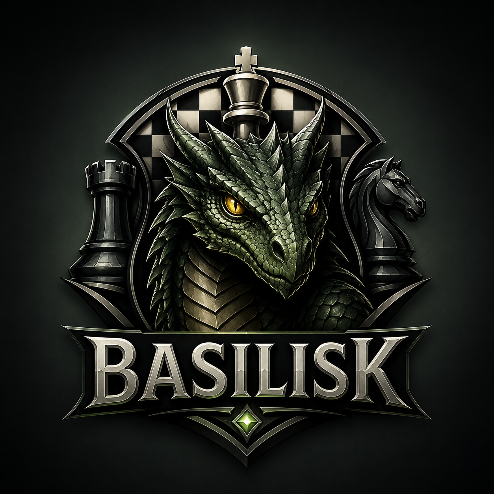

# Basilisk

<p align="center">
  
</p>

A UCI chess engine written in C++23.

## Features

### Search
- Iterative deepening with aspiration windows
- Negamax alpha-beta / Principal Variation Search (PVS)
- Persistent Lazy SMP thread pool with shared TT, shared root-move feedback, exact `Threads` resizing, and aggregate node/tbhit accounting
- Transposition table — atomic 3-entry clusters aligned to 64-byte cache lines, with generational aging
- TT prefetching, exact-entry replacement preference, and age-aware `hashfull`
- Null move pruning
- High-depth null-move verification to reduce risky null cutoffs
- Reverse futility pruning (RFP)
- Razoring
- ProbCut
- Late move reductions (LMR)
- Internal Iterative Reductions (IIR) — also fires on stale TT entries
- Singular extensions
- Check extension — extend by 1 ply when in check
- Mate-distance handling that continues past the first forced mate to prefer shorter mates
- Optional Syzygy tablebase probing at the root and in search, with root move ranking, best-rank filtering, and tablebase PV expansion
- Quiescence search with in-check evasion, capture futility, dynamic threshold-SEE pruning, and fail-soft cutoff returns
- Static Exchange Evaluation (SEE) and threshold SEE for capture pruning and bad-capture reductions
- Checking moves are protected from late pruning and late move reductions
- Search-aware repetition detection that distinguishes root repeats from in-tree repeats and respects null moves

### Move ordering
- Staged MovePicker: TT move, good tactical moves, quiet moves, then bad tactical moves
- Lazy quiet generation; quiets are not generated if tactical moves cut off
- MVV/LVA captures with capture history
- Killer moves (2 per ply)
- Countermove heuristic
- Quiet history `[color][from][to]`
- Capture history `[piece][to][captured]`
- Continuation history (1-ply, 2-ply, and 4-ply)
- Pawn-structure keyed quiet history and low-ply quiet history

### Evaluation
- Tapered material + piece-square tables (PeSTO, public domain)
- Game phase interpolation (midgame ↔ endgame)
- Mobility scoring
- Pawn structure: passed pawns, isolated pawns, doubled pawns; passed-pawn advance safety accounts for all enemy attackers
- King safety: attack unit table with piece coordination bonuses; reduced threat when opponent lacks a queen
- Endgame scaling: scale-factor framework (0–64) with an exact KPK bitbase, KBNK wrong-corner mate technique, KNNK/no-pawn-minor draw recognition, and opposite-coloured-bishop draw scaling
- Color-aware pawn, minor-piece, non-pawn, and continuation correction histories
- 50-move-rule score damping for non-mating evaluations

### Time management
- Soft limit (target) / hard limit (maximum)
- Adaptive soft limit based on best-move stability
- Root best-move effort tracking to spend less time on obvious moves and more on unstable roots
- `movestogo` aware; move-overhead compensation
- Final UCI legality guard for `bestmove`, ponder moves, and reported PV lines
- Strict TT move validation prevents stale or hash-aliased moves from corrupting board state or producing illegal PVs
- Ponder move reporting can recover a legal reply from the child-position TT entry when the principal variation is too short
- Complete UCI ponder lifecycle: `go ponder` waits for `stop` or `ponderhit`, `ponderhit` preserves elapsed ponder time, and stale control state is cleared between searches

---

## UCI options

| Option         | Type   | Default | Range     | Description                                   |
|----------------|--------|---------|-----------|-----------------------------------------------|
| `Threads`      | spin   | 1       | 1 – max(1024, 4*hardware_concurrency) | Search worker threads; applied immediately by `setoption` |
| `Hash`         | spin   | 64      | 1 – 33554432 | Transposition table size in MB                |
| `Clear Hash`   | button | —       | —         | Clears the transposition table immediately    |
| `Ponder`       | check  | false   | —         | Advertises support for ponder searches; GUIs start them with `go ponder` |
| `Move Overhead`| spin   | 10      | 0 – 5000  | Extra latency to subtract from clock (ms)     |
| `SyzygyPath`   | string | `<empty>` | —       | Semicolon-separated Syzygy tablebase directories; empty disables probing |
| `SyzygyProbeDepth` | spin | 1    | 1 – 100   | Minimum remaining search depth for non-root WDL probes |
| `Syzygy50MoveRule` | check | true | —        | Respect the 50-move rule in root tablebase move ranking |
| `SyzygyProbeLimit` | spin | 7 | 0 – 7 | Maximum piece count for tablebase probing; 0 disables probing |

---

## Building

Basilisk uses **CMake ≥ 3.24** with [CMake presets](CMakePresets.json) for all common configurations.
GCC, Clang, and LLVM are supported where available; use `bench` to measure which produces a faster binary on your CPU because results vary by microarchitecture and compiler version.

### Prerequisites

| Tool | Minimum version |
|------|----------------|
| CMake | 3.24 |
| Ninja | any |
| GCC ≥ 11 or Clang ≥ 16 | (C++23 required) |

### Compiler Selection

The presets use `COMP=auto` by default:

| Platform | `auto` compiler |
|---|---|
| Apple Silicon macOS | Clang from `PATH` (normally AppleClang) |
| Linux | Clang |
| Windows / MSYS2 | Clang |

Intel macOS is intentionally not supported. Apple Silicon macOS local builds use
AppleClang by default because it is available with Xcode Command Line Tools.
Official macOS release assets use AppleClang for the same compatibility reason.

Install the usual macOS build tools with:

```bash
brew install ninja cmake
```

Install LLVM too if you want to compare NPS locally:

```bash
brew install llvm
```

On Apple Silicon macOS, `COMP=llvm` uses Homebrew LLVM from
`/opt/homebrew/opt/llvm`. If CMake does not report the host or target CPU before
compiler detection, the configure step falls back to `uname -m` so native
Apple Silicon shells still configure correctly.

You can override the compiler when configuring a fresh build directory with a
CMake cache variable:

```bash
cmake --preset release -DCOMP=clang
cmake --preset release -DCOMP=gcc
cmake --preset release -DCOMP=llvm
```

Supported values are `auto`, `clang`, `gcc`, and `llvm`. If you change
compiler selection, remove the existing build directory first so CMake does not
reuse the old compiler cache.

### Presets

| Preset | Build type | Notes |
|---|---|---|
| `release` | Release | `-O3 -march=native` + LTO. **Use for playing/benchmarking.** |
| `release-avx2` | Release | Like `release` + AVX2 code generation |
| `release-pext` | Release | Like `release` + BMI2 PEXT sliding-piece attacks (Haswell+ / Zen 3+) |
| `debug` | Debug | `-O0 -g3` + AddressSanitizer + UBSan |
| `relwithdebinfo` | RelWithDebInfo | `-O2 -g -march=native`, no sanitizers |

For distributable binaries, add `-DPORTABLE_BUILD=ON` when configuring. This keeps the optimization level but omits `-march=native`, so release artifacts are not tied to the build machine's CPU.

### Profile-guided release builds

GitHub release builds do not use PGO; they build and upload the normal portable
release assets. PGO is intended for local builds where you control the target
machine and training workload.

CMake exposes PGO as a build target. Configure the normal preset once, then
build the `pgo` target:

```powershell
cmake --preset release-avx2 -DCOMP=clang
cmake --build --preset release-avx2 --target pgo
```

The target creates an instrumented `build\<preset>-pgo-generate` binary, trains
it with the internal `bench 13` command (a fixed 40-position suite spanning
openings, quiet and tactical middlegames, a broad range of endgames, mates, and
fortresses), prints concise training progress, merges the profile with
`llvm-profdata`, and builds the optimized binary in `build\<preset>-pgo`.
Detailed engine training logs are kept under `build\<preset>-pgo-profile` for
diagnostics. Use `release`,
`release-avx2`, or `release-pext` as the preset depending on which CPU tier you
want. The final PGO executable is also copied to `build/dist` with a `-pgo`
suffix before the executable extension.

GitHub release assets keep the x86_64 choices intentionally small:

| Asset suffix | CPU requirement | Notes |
|---|---|---|
| none | Generic target architecture | Safest default choice |
| `avx2` | x86_64 with AVX2 | Modern Intel/AMD x86_64 CPUs |
| `pext` | x86_64 with BMI2/PEXT | Uses PEXT sliding-piece attack lookup; benchmark against `avx2` on your CPU |

The x86 feature builds check CPU support at startup and print a clear error if the host CPU cannot run that binary.

Release builds are produced for Linux x86_64, Linux aarch64, Windows x86_64,
Windows aarch64, and macOS aarch64. Intel macOS and AVX-512 release assets are
not published.

### Linux / macOS

Install GCC (or Clang), CMake, and Ninja via your package manager, then:

```bash
cmake --preset release
cmake --build --preset release
# Binary: build/release/basilisk
# Release-style copy: build/dist/basilisk-v<version>-<os>-<arch>
```

### Windows (MSYS2 / MinGW-w64)

**Option 1 — Add MSYS2 to your PATH** (simplest; works from any terminal, CLion, VS Code, etc.):

Open *System Properties → Environment Variables* and prepend one MSYS2 toolchain directory to `Path`:
```
D:\msys64\clang64\bin
```
Then in any terminal:
```powershell
cmake --preset release
cmake --build --preset release
```

**Option 2 — `CMakeUserPresets.json`** (no PATH change; paths stay local and are gitignored):

Copy the example and edit the paths:
```powershell
Copy-Item CMakeUserPresets.json.example CMakeUserPresets.json
# Edit CMakeUserPresets.json: set the correct paths to ninja.exe, gcc.exe, g++.exe
```
Then build using the `local-` prefixed presets:
```powershell
cmake --preset local-release
cmake --build --preset local-release
```

**CLion:** configure a *MinGW* Toolchain under *Settings → Build → Toolchains* pointing to `D:\msys64\mingw64` (for GCC) or `D:\msys64\clang64` (for Clang).
CLion will inject the compiler from that toolchain and use the `release` / `debug` presets from `CMakePresets.json` directly.

> **Note:** Release builds on Windows/MinGW automatically link the C++ runtime statically (`-static`), so the resulting `basilisk.exe` has no dependency on MSYS2 DLLs and runs on any Windows machine. Disable with `-DSTATIC_RUNTIME=OFF` if you explicitly want a dynamic build.

---

## Usage

Basilisk is a standard UCI engine. Load it in any UCI-compatible GUI (Arena, Cutechess, Fritz, Banksia, …) or use it from the command line for analysis:

```
position startpos moves e2e4 e7e5
go movetime 5000
```

To use Syzygy tablebases, set `SyzygyPath` to the directory containing `.rtbw`
and `.rtbz` files before starting a search. With an empty path, tablebase code is
disabled and normal playing strength is unchanged.

When tablebases are enabled, Basilisk probes root moves before search, reports
bounded tablebase scores (`cp 20000` for wins), expands tablebase PVs in
`info ... pv` output, and respects `Syzygy50MoveRule` for cursed wins and blessed
losses. `SyzygyProbeLimit` can be set to `0` to disable probing without clearing
the configured path.

### Supported UCI commands

| Command | Notes |
|---------|-------|
| `uci` | Identify engine and list options |
| `debug on\|off` | Toggle debug echoing of received commands |
| `isready` | Synchronise; always answered with `readyok` |
| `setoption name <n> [value <v>]` | Set an option; button types have no value |
| `ucinewgame` | Reset search state and clear TT |
| `position [startpos\|fen <fen>] [moves …]` | Set up board |
| `go [searchmoves …] [wtime … btime … winc … binc … movestogo … depth … nodes … mate … movetime … infinite … ponder]` | Start search; bare `go` defaults to depth 7 |
| `go perft <depth>` | Count legal leaf nodes from the current position; reports `Nodes searched` without `bestmove` |
| `stop` | Stop search; engine replies with `bestmove` |
| `ponderhit` | Switch from ponder to normal search |
| `bench [depth]` | Run built-in benchmark (default depth 13) using the current `Threads` option |
| `quit` | Exit |

---

## License

GPL-3.0-or-later. See [LICENSE](LICENSE). Syzygy probing uses the vendored
MIT-licensed Fathom library under [external/fathom/LICENSE](external/fathom/LICENSE).

---

## Acknowledgements

Thanks to the open-source chess-engine community for the technical inspiration
and engineering examples that make projects like this possible.
